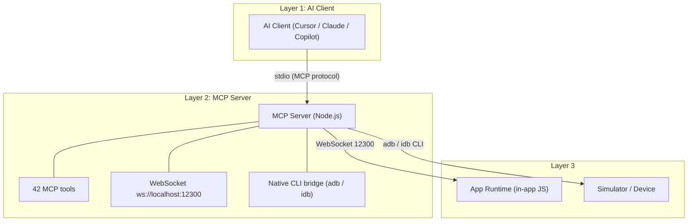
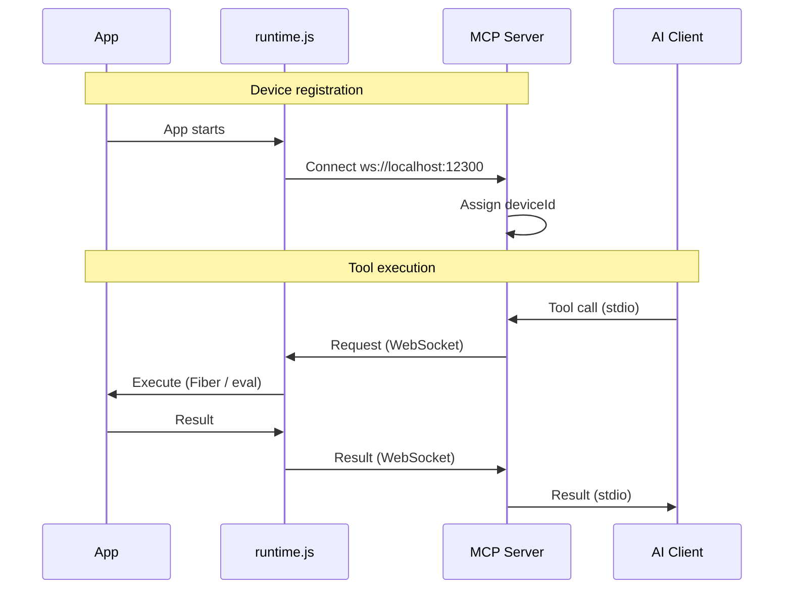
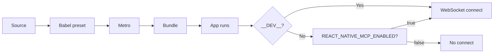

# Contribute

Thank you for contributing to React Native MCP. This page is for **developers** who want to set up the repo, run tests, or understand the architecture. User-facing docs (install, tools, test) are in [mcp](/mcp/) and [test](/testing/).

---

## How to contribute

- **Bug reports**: Open an [issue](https://github.com/ohah/react-native-mcp/issues/new) with clear steps to reproduce.
- **Feature ideas**: Start a [Discussion](https://github.com/ohah/react-native-mcp/discussions) or open an issue.
- **Docs**: Fix typos, add examples, or improve explanations.
- **Code**: Submit a Pull Request for bug fixes, features, or refactors.

---

## Development environment

The project uses [mise](https://mise.jdx.dev/) for Bun version management.

```bash
mise trust
mise install
bun install
```

### Run development

```bash
# All-in-one (MCP server + optional services)
bun run dev

# MCP server only
bun run dev:server
```

---

## Tests and code quality

```bash
# Unit tests
bun run test:unit

# With coverage
bun run test:coverage

# E2E (YAML scenarios, demo app)
bun run test:e2e -- -p ios
bun run test:e2e -- -p android
```

Before opening a PR, run:

```bash
bun run lint
bun run format
```

---

## Pull Request process

1. Fork the repo and create a branch.
2. Implement changes and run lint/format/tests locally.
3. Commit using the [commit guidelines](#commit-guidelines) below.
4. Push and open a PR to `main`. CI will run lint, build, and tests.

---

## Commit guidelines

We follow [Conventional Commits](https://www.conventionalcommits.org/).

**Format:** `(<scope>): <subject>` (body/footer optional)

**Types:** `feat` | `fix` | `refactor` | `test` | `docs` | `chore` | `style`

**Scopes (optional):** `server` | `react-native` | `docs` | `scripts` | `config`

**Principles:** One purpose per commit; separate unrelated changes; keep commits small and independently meaningful.

---

# Architecture

How React Native MCP works under the hood.

## Overview

React Native MCP enables AI tools (Cursor, Claude Desktop, Copilot) to control and inspect React Native apps. React Native has no DOM — so this project uses **React Fiber tree**, **Babel code injection**, and **native CLI tools** (adb/idb).

### Comparison with browser-based MCP

| Aspect         | Browser (DOM) MCP     | React Native MCP                                |
| -------------- | --------------------- | ----------------------------------------------- |
| Tree           | DOM tree              | React Fiber tree                                |
| Selectors      | CSS selectors         | testID, querySelector (Fiber selectors)         |
| Interaction    | querySelector + click | Fiber + native touch injection (tap/swipe)      |
| Snapshot       | HTML snapshot         | Component tree JSON                             |
| Screenshot     | Browser DevTools API  | adb / xcrun simctl (host CLI, no native module) |
| Communication  | WebSocket (DevTools)  | WebSocket + eval                                |
| Code injection | Not needed            | Babel/Metro required                            |

## Three-Layer Architecture



- **Layer 1 — AI Client:** Communicates with the MCP server over stdio (MCP protocol).
- **Layer 2 — MCP Server:** Node.js process exposing 42 tools, WebSocket on port 12300, and native CLI (adb/idb).
- **Layer 3 — App Runtime + Native Tools:** In-app `runtime.js` (Fiber, eval, network/console intercept) and host CLI for screenshot/tap (no native module in the app).

## Communication flow



Tools accept optional `deviceId` and `platform` for multi-device routing.

## Build pipeline

Babel preset (`@ohah/react-native-mcp-server/babel-preset`):

1. **Auto testID injection** for element selection.
2. **AppRegistry wrapping** to inject the runtime.



In production, runtime does not connect unless `REACT_NATIVE_MCP_ENABLED=true` when running Metro.

## Tool categories and data flow

| Category             | Examples                                    | Data path                          |
| -------------------- | ------------------------------------------- | ---------------------------------- |
| **Snapshot / Query** | `take_snapshot`, `query_selector`           | WebSocket → Fiber tree walk → JSON |
| **Interaction**      | `tap`, `swipe`, `input_text`                | Native CLI (adb/idb) → device      |
| **Assertions**       | `assert_text`, `assert_visible`             | WebSocket → Fiber tree check       |
| **Screenshot**       | `take_screenshot`                           | Native CLI → PNG file              |
| **State**            | `inspect_state`, `get_state_changes`        | WebSocket → React hooks inspection |
| **Network**          | `list_network_requests`, `set_network_mock` | WebSocket → XHR/fetch intercept    |
| **Console**          | `list_console_messages`                     | WebSocket → console intercept      |
| **Render**           | `start_render_profile`, `get_render_report` | WebSocket → render tracking        |
| **Eval**             | `evaluate_script`                           | WebSocket → JS eval in app         |
| **WebView**          | `webview_evaluate_script`                   | WebSocket → WebView JS bridge      |
| **Device**           | `list_devices`, `set_location`              | Native CLI                         |
| **File**             | `file_push`, `add_media`                    | Native CLI                         |

## Ports

| Port               | Purpose              |
| ------------------ | -------------------- |
| **12300**          | MCP server WebSocket |
| **8081** (default) | Metro bundler        |

## Package structure

```
packages/react-native-mcp-server/
├── src/
│   ├── index.ts                 # CLI + MCP server (stdio)
│   ├── websocket-server.ts      # WebSocket (12300)
│   ├── tools/                   # 42 MCP tools
│   ├── babel/                   # Babel preset (testID)
│   ├── metro/                   # Metro transformer
│   └── runtime/                 # Runtime source → runtime.js
├── runtime.js                   # Injected runtime (generated)
├── babel-preset.js
└── metro-transformer.cjs
```
