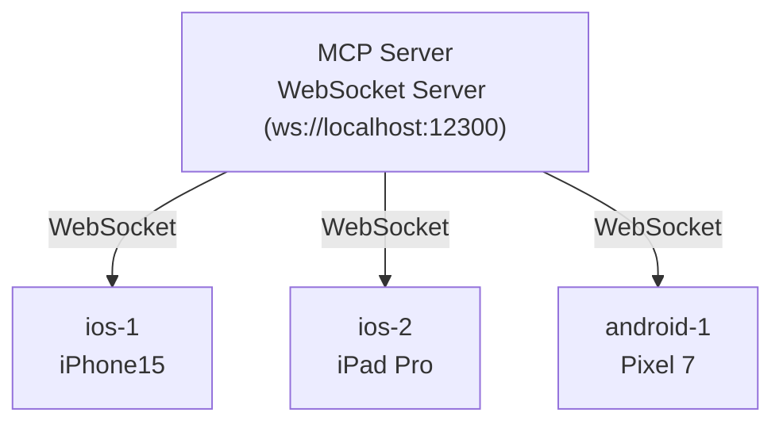

# Architecture

How React Native MCP works under the hood.

---

## Overview

React Native MCP enables AI tools (Cursor, Claude Desktop, Copilot) to control and inspect React Native apps. React Native has no DOM — so this project uses **React Fiber tree**, **Babel code injection**, and **native CLI tools** (adb/idb).

### Comparison with browser-based MCP

| Aspect         | Browser (DOM) MCP     | React Native MCP                                |
| -------------- | --------------------- | ----------------------------------------------- |
| Tree           | DOM tree              | React Fiber tree                                |
| Selectors      | CSS selectors         | testID, querySelector (Fiber selectors)         |
| Interaction    | querySelector + click | Fiber + native touch injection (tap/swipe)      |
| Snapshot       | HTML snapshot         | Component tree JSON                             |
| Screenshot     | Browser DevTools API  | adb / xcrun simctl (host CLI, no native module) |
| Communication  | WebSocket (DevTools)  | WebSocket + eval                                |
| Code injection | Not needed            | Babel/Metro required                            |

---

## Three-Layer Architecture

```mermaid
flowchart TB
  client["AI Client (Cursor / Claude / Copilot)"]
  server["MCP Server (Node.js)<br/>• 49 MCP tools<br/>• WebSocket server (ws://localhost:12300)<br/>• Native CLI bridge (adb / idb)"]
  runtime["App Runtime (in-app JS)"]
  device["Simulator / Device"]

  client -->|stdio (MCP protocol)| server
  server -->|WebSocket (12300)| runtime
  server -->|adb/idb CLI| device
```

### Layer 1: AI Client

The AI client (Cursor, Claude Desktop, Copilot CLI) communicates with the MCP server over **stdio** using the MCP protocol. It sends tool calls and receives results — the client doesn't know about React Native internals.

### Layer 2: MCP Server

A Node.js process that:

- Exposes **49 MCP tools** across 12 categories (interaction, assertions, screen capture, network mocking, state inspection, render profiling, video recording, visual comparison, accessibility, etc.)
- Runs a **WebSocket server** on port 12300 for bidirectional communication with the app
- Executes **native CLI commands** (adb for Android, idb for iOS simulator) for screenshots, tap, swipe, and text input

### Layer 3: App Runtime + Native Tools

- **Runtime** (`runtime.js`): Pure JavaScript injected into the app bundle by the Babel preset. Connects to `ws://localhost:12300`, exposes the Fiber tree, handles eval requests, intercepts network/console, and tracks state changes.
- **Native tools**: Screenshots and touch injection use host CLI tools (`adb exec-out screencap`, `xcrun simctl io screenshot`, `idb ui tap`), so **no native module is installed in the app**.

---

## Communication Flow

### Device Registration

```
App starts
  → runtime.js connects to ws://localhost:12300
  → Sends { type: 'init', platform, deviceName, metroBaseUrl }
  → Server assigns deviceId (e.g. 'ios-1', 'android-1')
  → appConnected becomes true
```

### Tool Execution

```
AI client calls tool (e.g. "take_snapshot")
  → MCP server receives via stdio
  → Server sends request over WebSocket to app
  → App runtime walks Fiber tree, returns component tree JSON
  → Server sends result back to AI client via stdio
```

### Multi-Device Support



Every tool accepts optional `deviceId` and `platform` parameters:

- `deviceId` specified → routes to that device
- `platform` specified + 1 device → auto-selects
- Only 1 device total → auto-selects (backwards compatible)
- Multiple devices without specifier → error (must specify `deviceId`)

---

## Build Pipeline

### How the Babel Preset Works

The Babel preset (`@ohah/react-native-mcp-server/babel-preset`) does two things at build time:

1. **Auto testID injection**: Adds `testID` props to components for reliable element selection
2. **AppRegistry wrapping**: Wraps `AppRegistry.registerComponent` to inject the runtime

```
Source Code
  ↓ Babel preset (testID injection, AppRegistry wrapping)
  ↓ Metro bundler
  ↓
Bundle (with runtime + Babel transforms)
  ↓
App runs → runtime detects __DEV__ → WebSocket auto-connects → MCP ready
```

In production builds, the runtime is included but doesn't connect unless `REACT_NATIVE_MCP_ENABLED=true` is set when running Metro.

---

## Tool Categories and Data Flow

| Category             | Examples                                                              | Data path                           |
| -------------------- | --------------------------------------------------------------------- | ----------------------------------- |
| **Snapshot / Query** | `take_snapshot`, `query_selector`, `query_selector_all`               | WebSocket → Fiber tree walk → JSON  |
| **Interaction**      | `tap`, `swipe`, `input_text`, `type_text`, `press_button`             | Native CLI (adb/idb) → device       |
| **Assertions**       | `assert_text`, `assert_visible`, `assert_state`                       | WebSocket → Fiber tree / state      |
| **Screenshot**       | `take_screenshot`                                                     | Native CLI → JPEG (or save to file) |
| **State**            | `inspect_state`, `get_state_changes`, `clear_state`                   | WebSocket → React hooks inspection  |
| **Network**          | `list_network_requests`, `set_network_mock`, `remove_network_mock`    | WebSocket → XHR/fetch intercept     |
| **Console**          | `list_console_messages`, `clear` (buffer)                             | WebSocket → console intercept       |
| **Render**           | `start_render_profile`, `get_render_report`, `start_render_highlight` | WebSocket → render tracking         |
| **Eval**             | `evaluate_script`                                                     | WebSocket → JS eval in app          |
| **WebView**          | `webview_evaluate_script`                                             | WebSocket → WebView JS bridge       |
| **Device**           | `list_devices`, `set_location`, `list_apps`, `terminate_app`          | Native CLI                          |
| **File**             | `file_push`, `add_media`                                              | Native CLI                          |
| **Video**            | `start_video_recording`, `stop_video_recording`                       | Native CLI (idb/adb screenrecord)   |
| **Visual**           | `visual_compare`                                                      | WebSocket + screenshot diff         |
| **Accessibility**    | `accessibility_audit`                                                 | WebSocket → a11y tree               |

---

## Port Usage

| Port               | Purpose                                           |
| ------------------ | ------------------------------------------------- |
| **12300**          | MCP server WebSocket — app runtime connects here  |
| **8081** (default) | Metro bundler (or custom, e.g. 8230 for demo app) |

The MCP server does not modify Metro's port or configuration. It runs independently and the app runtime connects to both Metro (for bundling) and the MCP server (for tool communication).

---

## Package Structure

Everything is in a single package for simplicity:

```
packages/react-native-mcp-server/
├── src/
│   ├── index.ts                 # CLI entry + MCP server (stdio)
│   ├── websocket-server.ts      # WebSocket server (multi-device, 12300)
│   ├── tools/                   # MCP tool implementations (49 tools)
│   ├── babel/                   # Babel preset (testID injection)
│   ├── metro/                   # Metro transformer
│   └── runtime/                 # Runtime source (compiled to runtime.js)
├── runtime.js                   # App-injected runtime (generated, do not edit)
├── babel-preset.cjs              # Babel preset entry
├── babel-plugin-app-registry.cjs # AppRegistry wrapping (runtime injection)
├── babel-plugin-inject-testid.cjs # testID injection
└── metro-transformer.cjs        # Metro transformer entry
```
