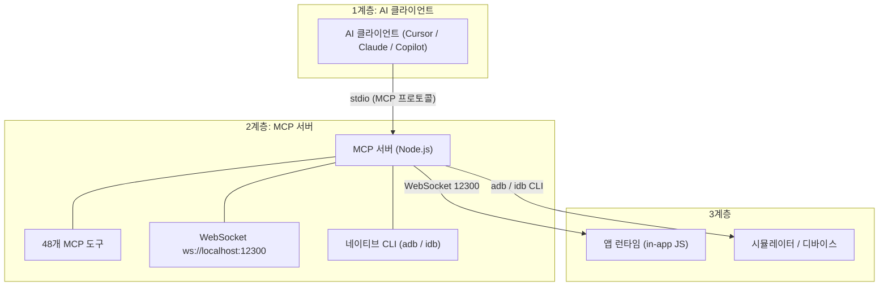
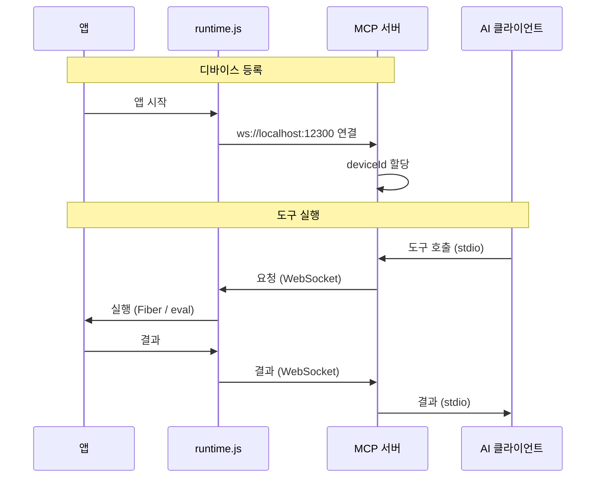
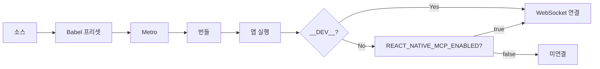

# 기여

React Native MCP에 기여해 주셔서 감사합니다. 이 페이지는 저장소 설정, 테스트 실행, 아키텍처 이해가 필요한 **개발자**를 위한 것입니다. 사용자용 문서(설치, 도구, 테스트)는 [mcp](/mcp/)와 [test](/test/)에 있습니다.

---

## 기여 방법

- **버그 리포트**: 재현 단계를 포함해 [이슈](https://github.com/ohah/react-native-mcp/issues/new)를 열어 주세요.
- **기능 제안**: [Discussion](https://github.com/ohah/react-native-mcp/discussions)을 시작하거나 이슈를 열어 주세요.
- **문서**: 오타 수정, 예제 추가, 설명 개선을 환영합니다.
- **코드**: 버그 수정·기능 추가·리팩터링은 Pull Request로 제출해 주세요.

---

## 개발 환경

프로젝트는 [mise](https://mise.jdx.dev/)로 Bun 버전을 관리합니다.

```bash
mise trust
mise install
bun install
```

### 개발 서버 실행

```bash
# 통합 (MCP 서버 등)
bun run dev

# MCP 서버만
bun run dev:server
```

---

## 테스트 및 코드 품질

```bash
# 유닛 테스트
bun run test:unit

# 커버리지 포함
bun run test:coverage

# E2E (YAML 시나리오, 데모 앱)
bun run test:e2e -- -p ios
bun run test:e2e -- -p android
```

PR 전에 로컬에서 실행:

```bash
bun run lint
bun run format
```

---

## Pull Request 절차

1. 저장소를 포크하고 브랜치를 만듭니다.
2. 변경 후 로컬에서 lint/format/테스트를 실행합니다.
3. 아래 [커밋 가이드라인](#커밋-가이드라인)에 맞춰 커밋합니다.
4. 푸시 후 `main`으로 PR을 엽니다. CI에서 lint, 빌드, 테스트가 실행됩니다.

---

## 커밋 가이드라인

[Conventional Commits](https://www.conventionalcommits.org/)를 따릅니다.

**형식:** `(<scope>): <subject>` (body/footer 선택)

**타입:** `feat` | `fix` | `refactor` | `test` | `docs` | `chore` | `style`

**스코프(선택):** `server` | `react-native` | `docs` | `scripts` | `config`

**원칙:** 커밋당 하나의 목적, 관련 없는 변경은 분리, 작고 독립적으로 의미 있는 단위로 커밋.

---

## VS Code 확장 개발

DevTools 확장은 `editor/vscode`에 있습니다.

**빌드:**

```bash
cd editor/vscode
bun install
bun run build    # dist/extension.js + dist/webview.js
bun run watch    # 파일 변경 시 자동 재빌드
```

**디버깅 (Extension Development Host):** VS Code에서 `editor/vscode` 폴더 열기 → `F5` → 확장이 로드된 새 창이 열림.

**아키텍처:** 확장은 `ws://localhost:12300`으로 MCP 서버에 `extension-init` 클라이언트로 연결 (Cursor/Claude와 동일 서버, stdio 사용). 흐름: VS Code 확장 → WebSocket → MCP 서버 → eval → RN 앱.

---

# 아키텍처

React Native MCP의 내부 동작 원리입니다.

## 개요

React Native MCP는 AI 도구(Cursor, Claude Desktop, Copilot)가 React Native 앱을 제어·검사할 수 있게 합니다. React Native에는 DOM이 없어 **React Fiber 트리**, **Babel 코드 주입**, **네이티브 CLI**(adb/idb)를 사용합니다.

### 브라우저(DOM) MCP와 비교

| 항목      | 브라우저(DOM) MCP     | React Native MCP                                    |
| --------- | --------------------- | --------------------------------------------------- |
| 트리      | DOM tree              | React Fiber tree                                    |
| 선택자    | CSS selector          | testID, querySelector (Fiber 셀렉터)                |
| 조작      | querySelector + click | Fiber + 네이티브 터치 주입 (tap/swipe)              |
| 스냅샷    | HTML snapshot         | 컴포넌트 트리 JSON                                  |
| 스크린샷  | 브라우저 DevTools API | adb / xcrun simctl (호스트 CLI, 네이티브 모듈 없음) |
| 통신      | WebSocket (DevTools)  | WebSocket + eval                                    |
| 코드 주입 | 불필요                | Babel/Metro 필수                                    |

## 3계층 아키텍처



- **1계층 — AI 클라이언트:** stdio(MCP 프로토콜)로 MCP 서버와 통신.
- **2계층 — MCP 서버:** Node.js 프로세스, 48개 도구, 포트 12300 WebSocket, 네이티브 CLI(adb/idb).
- **3계층 — 앱 런타임 + 네이티브 도구:** 앱 내 `runtime.js`(Fiber, eval, 네트워크/콘솔 인터셉트)와 스크린샷/탭용 호스트 CLI(앱에 네이티브 모듈 없음).

## 통신 흐름



멀티 디바이스 라우팅을 위해 도구는 선택적 `deviceId`, `platform` 파라미터를 받습니다.

## 빌드 파이프라인

Babel 프리셋(`@ohah/react-native-mcp-server/babel-preset`):

1. **testID 자동 주입** — 요소 선택용.
2. **AppRegistry 래핑** — 런타임 주입.



프로덕션에서는 Metro 실행 시 `REACT_NATIVE_MCP_ENABLED=true`가 아니면 런타임이 연결하지 않습니다.

## 도구 카테고리별 데이터 흐름

| 카테고리          | 예시                                        | 데이터 경로                        |
| ----------------- | ------------------------------------------- | ---------------------------------- |
| **스냅샷 / 쿼리** | `take_snapshot`, `query_selector`           | WebSocket → Fiber 트리 순회 → JSON |
| **인터랙션**      | `tap`, `swipe`, `input_text`                | 네이티브 CLI (adb/idb) → 디바이스  |
| **검증**          | `assert_text`, `assert_visible`             | WebSocket → Fiber 트리 확인        |
| **스크린샷**      | `take_screenshot`                           | 네이티브 CLI → PNG 파일            |
| **상태**          | `inspect_state`, `get_state_changes`        | WebSocket → React hooks 검사       |
| **네트워크**      | `list_network_requests`, `set_network_mock` | WebSocket → XHR/fetch 인터셉트     |
| **콘솔**          | `list_console_messages`                     | WebSocket → console 인터셉트       |
| **렌더**          | `start_render_profile`, `get_render_report` | WebSocket → 렌더 추적              |
| **실행**          | `evaluate_script`                           | WebSocket → 앱 내 JS eval          |
| **WebView**       | `webview_evaluate_script`                   | WebSocket → WebView JS 브릿지      |
| **디바이스**      | `list_devices`, `set_location`              | 네이티브 CLI                       |
| **파일**          | `file_push`, `add_media`                    | 네이티브 CLI                       |

## 포트

| 포트              | 용도               |
| ----------------- | ------------------ |
| **12300**         | MCP 서버 WebSocket |
| **8081** (기본값) | Metro 번들러       |

## 패키지 구조

```
packages/react-native-mcp-server/
├── src/
│   ├── index.ts                 # CLI + MCP 서버 (stdio)
│   ├── websocket-server.ts      # WebSocket (12300)
│   ├── tools/                   # 48개 MCP 도구
│   ├── babel/                   # Babel 프리셋 (testID)
│   ├── metro/                   # Metro transformer
│   └── runtime/                 # 런타임 소스 → runtime.js
├── runtime.js                   # 주입 런타임 (생성됨)
├── babel-preset.js
└── metro-transformer.cjs
```
