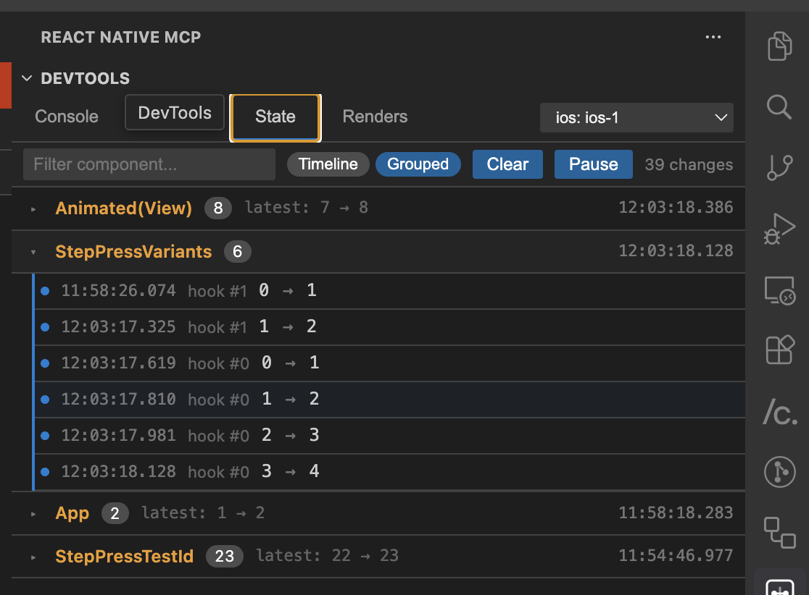

# React Native MCP DevTools

VS Code 확장. MCP 서버에 연결해 Chrome DevTools 스타일의 GUI(Console, Network, State, Renders, Component Tree)를 에디터 안에서 제공합니다.

## 미리보기

**State 탭** — 컴포넌트별 상태 변경 이력, Hook 변경 추적



## 설치·사용

- **로컬 설치**: [설치 및 사용 가이드](https://ohah.github.io/react-native-mcp/document/docs/ko/mcp/vscode-extension) (한국어)
- **영문**: [VS Code Extension (DevTools)](https://ohah.github.io/react-native-mcp/document/docs/en/mcp/vscode-extension)

## 개발

```bash
bun install
bun run build      # extension + webview 빌드
bun run watch      # 감시 빌드
bun run package    # .vsix 패키지 생성
```

F5로 Extension Development Host에서 디버깅 가능.
